# BVE-Pressless
Youtube explanation vid 👇<br>
[](https://youtu.be/zJsPiHQJqWM)<br>
Play BVE Train Simulator with camera <br>
Inspired by : https://youtu.be/HgFxFOzxCPk

> <b>Disclaimer!</b><br>
> I use BVE 5. I don't know this program can be use in another version or not

## Library
There some Python libraries I use : 
- `opencv`
- `pyautogui`
- `cvzone` (You must install `mediapipe` and `opencv` first)

```console
pip install opencv pyautogui mediapipe cvzone
```

## BVE Settings
`Preferences... > Input Devices > Key assignments...`
<div align="center">
    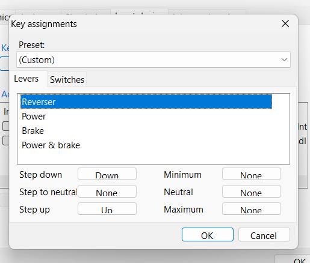
    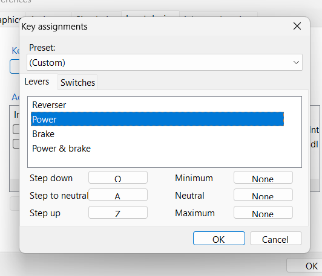
    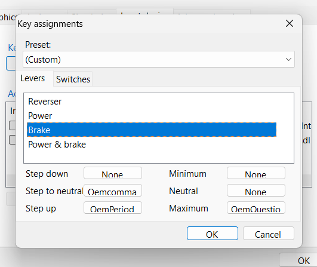
    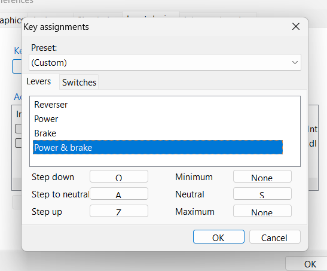
</div>

## Key
Based on BVE settings, you can use : 
- <b>Clench</b> : Neutral <br>
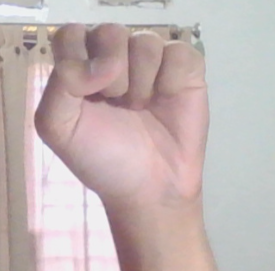
- <b>Pointing ahead</b> : Move reverser Forward // Ubah reverser ke "Maju"<br>
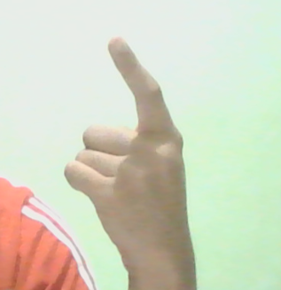
- <b>Pointing backward (with thumb)</b> : Move reverser Backward // Ubah reverser ke "Mundur"<br>
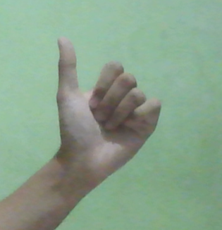
- <b>Index up</b> : Reduce Power // Kurangi Tenaga <br>
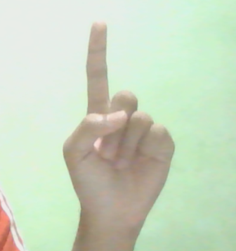
- <b>Index with Middle</b> : Increase Power // Tambah Tenaga <br>
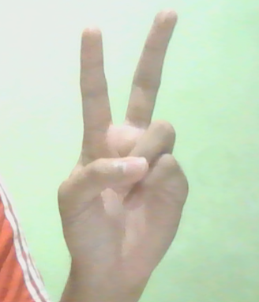
- <b>Index, Middle, and Ring</b> : Reduce Brake // Kurangi Rem <br>
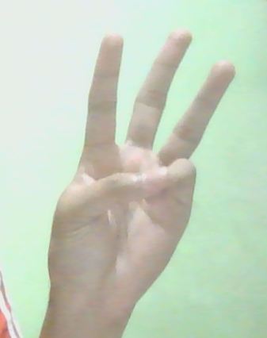
- <b>Index, Middle, Ring, and Little</b> : Increase Brake // Tambah Rem<br>
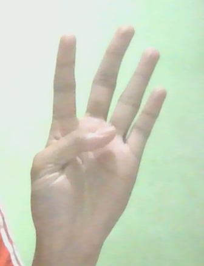
- <b>Splayed hand</b> : Emergency Brake // Rem Darurat<br>
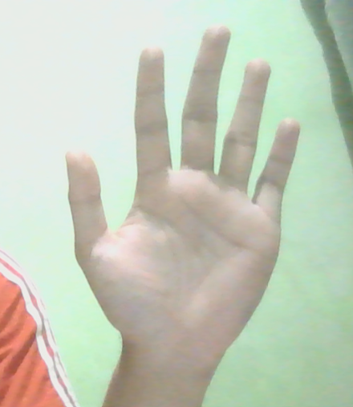
- <b>"Call"</b> : Horn // Klakson<br>
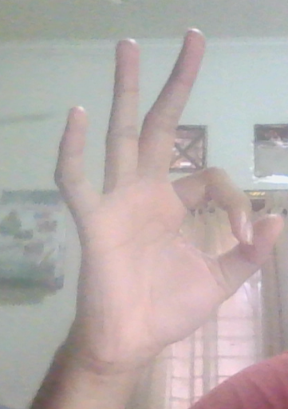

> You must move fast if you just want to move one step e.g. brake <br>
> Harus gercep kalau hanya ingin bergerak satu langkah, misal rem